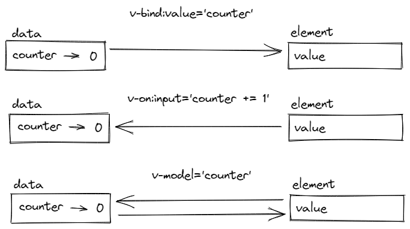

<style>
.vue-example {
    border:solid;
    padding-left: 2rem;
    border-color:lightgray;
    border-radius: 5px;
}
img {
  display: block;
  width: 100%;
  height: auto;
}
.card {
  display: inline-block;
  width: 32px;
  height: 32px;
  background-color: green;
}
</style>

# Mentoria VueJS


## Radix Engenharia e Software
### Varlen Pavani Neto
#### 2021

---

## Pré-Requisitos
- Conhecimento intermediario de HTML, CSS e Javascript
- NPM

---

## Contexto
- Criado por Evan You (ex-Google/AngularJS)
- Progressivo 
    - Usado direto da CDN
    - Não é necessário usar npm/compilador, mas se quiser, pode
- Reativo
    - Atualiza a exibição dos dados automaticamente ao detectar uma mudança de valor
- Atualmente na versão 3.x, porém a versão 2.x ainda é amplamente utilizada e suportada
- Aqui estaremos trabalhando com Vue 2
    - Especificamente com a Options API

---

## Hello World em Vue


```html
<!-- definição do template -->
<div id="helloWorldApp">
 <h4>Hello, {{ personName }}!</h4>
</div>

<!-- carregando Vue diretamente da CDN -->
<script src="https://unpkg.com/vue"></script>

<!-- definição do app Vue -->
<script>
const helloWorldApp = new Vue({
  el: '#helloWorldApp',
  data: {
    personName: 'Varlen'
  }
})
</script>
```

<div id="helloWorldApp" class="vue-example">
 <h4>Hello, {{ personName }}!</h4>
</div>

<!-- carregando o vue diretamente da CDN -->
<script src="https://unpkg.com/vue"></script>

<!-- definição do app Vue -->
<script>
const helloWorldApp = new Vue({
  el: '#helloWorldApp',
  data: {
    personName: 'Varlen'
  }
})
</script>

---
## Diretivas
#### Inspiradas no AngularJS
- v-if
- v-else-if
- v-else

- v-for
- v-bind
- v-on

---

## Diretivas: v-if / v-else-if / v-else

```html
<div id="ifApp">
  <h3>💡:</h3>
  <span v-if="lampPowered">ON</span>
  <span v-else>OFF</span>
</div>

<script>
const ifApp = new Vue({
  el: '#ifApp',
  data: {
    lampPowered : false
  }
})
</script>
```

<div id="ifApp" class="vue-example">
  <p>💡 :
    <span v-if="lampPowered">ON</span>
    <span v-else>OFF</span>
  </p>
</div>

<script>
const ifApp = new Vue({
  el: '#ifApp',
  data: {
    lampPowered : false
  }
})
</script>

---

## Diretivas: v-for

```html
<div id="forApp" >
  <ul>
    <li v-for="item in shoppingList">{{ item }}</li>
  </ul>
</div>

<script>
const forApp = new Vue({
  el: '#forApp',
  data: {
    shoppingList : ["banana", "pão", "queijo", "leite"]
  }
})
</script>
```

<div id="forApp" class="vue-example">
  <ul>
    <li v-for="item in shoppingList">{{ item }}</li>
  </ul>
</div>

<script>
const forApp = new Vue({
  el: '#forApp',
  data: {
    shoppingList : ["banana", "pão", "queijo", "leite"]
  }
})
</script>

---

## Diretivas: v-bind
- Associa uma variável à um atributo de um elemento

```html
<div id="bindApp">
  <input type="number" v-bind:min="minimumAge" />
  <p> A idade mínima é {{ minimumAge }} anos</p>
</div>
<script>
  const bindApp = new Vue({
    el: '#bindApp',
    data: {
      minimumAge : 18
    }
  })
</script>
```

<div id="bindApp" class="vue-example">
    <input type="number" v-bind:min="minimumAge" />
    <p> A idade mínima é de {{ minimumAge }} anos.</p>
</div>
<script>
  const bindApp = new Vue({
    el: '#bindApp',
    data: {
      minimumAge : 18
    }
  })
</script>

---

## Detalhe importante do v-for: key
- Ao usar uma lista de objetos com v-for
    - Vue precisa saber qual parâmetro do objeto identifica aquele objeto como único
    - Se o objeto possuir uma proprieda que é exclusiva, use-a:
        ```html
        <li v-for="item in list" v-bind:key="item.id">
        ```

    - Senão, você pode utilizar um id gerado de acordo com a posição do objeto na lista:
        ```html
        <li v-for="item, id in list" v-bind:key="id">
        ```

---

## Diretivas: v-on
- Reage a um evento, especificado como ```v-on:<evento>```

```html
<div id="counterApp">
  <p>O botão foi clicado {{ counter }} {{ counter === 1 ? 'vez' : 'vezes' }}!</p>
  <button v-on:click="counter += 1">Clique aqui!</button>
</div>
<script>
  const counterApp = new Vue({
    el: '#counterApp',
    data: {
      counter : 0
    }
  })
</script>
```

<div id="counterApp" class="vue-example">
    <p>O botão foi clicado {{ counter }} {{ counter === 1 ? 'vez' : 'vezes' }}!</p>
    <button v-on:click="counter += 1">Clique aqui!</button>
</div>
<script>
  const counterApp = new Vue({
    el: '#counterApp',
    data: {
      counter : 0
    }
  })
</script>

---

## Diretivas: v-model
- Two way data binding. 
- Equivalente ao ```[()]``` no Angular

```html
<div id="inputApp" class="vue-example">
  <input type="text" placeholder="Nome" v-model="name"/>
  <p> Hello, {{ name }}! </p>
</div>
<script>
  const inputApp = new Vue({
    el: '#inputApp',
    data: {
      name : 'fulano'
    }
  })
</script>
```

<div id="inputApp" class="vue-example">
  <input type="text" placeholder="Nome" v-model="name"/>
  <p> Hello, {{ name }}! </p>
</div>
<script>
const inputApp = new Vue({
  el: '#inputApp',
  data: {
    name : 'fulano'
  }
})
</script>

---



---

# Componentes
- O Vue permite organizar o código em componentes reutilizáveis
- O jeito padrão de se utilizar componentes é atráves de **Single File Components**
    - Requer um empacotador como Webpack
- Também é possível criar componentes apenas com javascript, sem precisar compilar
- Componentes recebem dados externos a partir de **props**
- Podem se comunicar com o mundo externo através da **emissão de eventos**

---

# Componentes

```html
<div id="componentApp">
  <ul>
    <fancy-list-element v-for="item in shoppingList" v-bind:text="item.text" v-bind:key="item.id">
  </ul>
</div>

<script>
Vue.component('fancy-list-element', {
  props: ['text'],
  template: '<li style="font-family:fantasy;color:blue">{{ text }}</li>'
})

var componentApp = new Vue({
  el: '#componentApp',
  data: {
    shoppingList: [
      { id: 0, text: 'Abacate' },
      { id: 1, text: 'Linguiça' },
      { id: 2, text: 'Suco de Laranja' }
    ]
  }
})
</script>
```

---

# Componentes

<div id="componentApp" class="vue-example">
  <ol>
    <fancy-list-element v-for="item in shoppingList" v-bind:text="item.text" v-bind:key="item.id">
  </ol>
</div>

<script>
Vue.component('fancy-list-element', {
    props: ['text'],
    template: '<li style="font-family:fantasy;color:blue">{{ text }}</li>'
})

var componentApp = new Vue({
  el: '#componentApp',
  data: {
    shoppingList: [
      { id: 0, text: 'Abacate' },
      { id: 1, text: 'Linguiça' },
      { id: 2, text: 'Suco de Laranja' }
    ]
  }
})
</script>

--- 
# Instância Vue

- Inicialização da instância Vue
    ```javascript
    var vm = new Vue({} /* objeto de opções */)
    ```
- As opções definem o comportamento da instância inicializada
    - A instância pode ser um componente ou uma aplicação.
    - Componentes também são instâncias Vue
- As aplicações Vue são formadas por uma árvore de componentes dentro de uma instância Vue raiz
    ```
    Root Instance
    └─ TodoList
    ├─ TodoItem
    │  ├─ TodoButtonDelete
    │  └─ TodoButtonEdit
    └─ TodoListFooter
        ├─ TodosButtonClear
        └─ TodoListStatistics
    ```

--- 
# Options

- data
    - Propriedades no objeto **data** são adicionadas ao sistema de **reatividade** do Vue
    - Vue renderiza novamente os componentes que dependem das propriedades rastreadas ao detectar modificações

    - **Atenção** : Somente propriedades que já existem quando a instância for criada são rastreadas pelo Vue

---
# Options

```javascript
const carroApp = new Vue({
  data : {
    vaga: 1,
    nome: 'Varlen',
    carro: {
      placa: 'ABC-1234',
      modelo: 'Palio',
      ano: '2012'
    }
  }
})

carroApp.vaga = 2; 
// Atualiza o valor da propriedade vaga e engatilha a reatividade

carroApp.combustivel = 'Gasolina' 
// Essa propriedade não existia quando a instância Vue foi criada
// Não engatilha a reatividade
```

---

# Ciclo de Vida da Instância e Hooks
- A instância realiza uma série de atividades durante sua existência:
  - Definir os dados a serem observados
  - Compilar o template (se não estiver usando single-file component)
  - Montar a instância no DOM
  - Atualizar o DOM quando dados são alterados

- Em algumas destas atividades, o Vue pode chamar uma função definida pelo usuário (**lifecycle hooks**)

---

# Lifecycle Hooks

- Os lifecycle hooks são:
  - beforeCreate, created, beforeMount, mounted
  - beforeUpdate, updated
  - beforeDestroy, destroyed

- As funções devem ser definidas no objeto de Options
- São chamadas tendo a instância associada ao **this**
  - Por esse motivo, **não se pode usar Arrow Functions** para definir hooks 

- <a href="https://vuejs.org/images/lifecycle.png">Diagrama do ciclo de vida</a>

--- 

# Métodos

- É possível definir métodos para a instância Vue a partir da propriedade **methods**. Os métodos são funções que podem ser usadas no template ou por outros métodos


---

# Templates HTML
- Os templates Vue sempre são HTMLs válidos 
- É possível transformar um componente Vue em Web Component
- Interpolação
  - É possível interpolar propriedades do **data** diretamente no html
    ```html
    <p>Nome: {{ nome }}</p>
    
    ```
  - Também é possível interpolar expressões JavaScript
    ```html
    <p>Nome: {{ nome ?? 'Fulano' }}</p>
    <p>Cidades: {{ cidades.join(',') }}</p>
    ```

---

# Abreviações
O Vue fornece abreviações para as diretivas:

- **v-on** vira **@**
```html
<!-- completo -->
<a v-on:click="doSomething"> ... </a>

<!-- abreviado -->
<a @click="doSomething"> ... </a>
```


- **v-bind** vira **:** (dois pontos)
```html
<!-- completo -->
<a v-bind:href="url"> ... </a>

<!-- abreviado -->
<a :href="url"> ... </a>
```

---

# Computed Properties

- Apesar dos templates suportarem expressões JavaScript, em alguns casos, a expressão será utilizada em varios lugares do componente.
- Nesses casos, ao invés de repetir a expressão, é possível usar uma **Computed Property**
- A Computed Property é uma função que deve retornar o valor calculado
- O Vue atualiza as propriedades ao detectar modificações nas dependencias da propriedade

---

# Computed Properties

```html
<div id="computedApp" >
  Minha lista: {{ commaSeparatedShoppingList }}
</div>

<script>
const computedApp = new Vue({
  el: '#computedApp',
  computed: {
    commaSeparatedShoppingList : function() {
      return this.shoppingList.join(',')
    }
  },
  data: {
    shoppingList : ["banana", "pão", "queijo", "leite"]
  }
})
</script>
```

<div id="computedApp" class="vue-example">
  Minha lista: {{ commaSeparatedShoppingList }}
</div>

<script>
const computedApp = new Vue({
  el: '#computedApp',
  computed: {
    commaSeparatedShoppingList : function() {
      return this.shoppingList.join(',')
    }
  },
  data: {
    shoppingList : ["banana", "pão", "queijo", "leite"]
  }
})
</script>

---

# Computed Properties

- A Computed Property é um *getter* de uma propriedade com mesmo nome na instância, por padrão
  - Pode ser lida como se fossem uma propriedade comum no data, (**read only**)
- E qual é a diferença para um método? Cache!
- É possível também definir um *setter* para uma Computed Property, se for necessário

---

# Watchers

- Em alguns casos, uma Computed Property não é suficiente
  - Por exemplo, você precisa realizar uma operação assíncrona ao detectar uma mudança
  - Vamos dar uma olhada na doc oficial

<a href="https://vuejs.org/v2/guide/computed.html#Watchers">Documentação oficial</a>

---

# Class bindings

- É possível passar um objeto para um v-bind de classe
- Isso permite controlar classes CSS a partir do data
- O bind pode existir com uma propriedade class estática

---

# Class bindings

```html
<div id="classBindingApp">
 <div 
 class="card" 
 :class="{ rotated: isRotated, yellow: isYellow }"
 ></div>
 <span><input type="checkbox" v-model="isRotated"/> rotate </span>
 <span><input type="checkbox" v-model="isYellow"/> yellow </span>
</div>

<style>
.yellow {
  background-color: yellow;
}
.rotated {
  transform: rotate(30deg)
}
</style>

<script>
const classBindingApp = new Vue({
  el: '#classBindingApp',
  data: {
    isRotated: false,
    isYellow: false
  }
})
</script>
```

<div id="classBindingApp">
 <div 
 class="card" 
 :class="{ rotated: isRotated, yellow: isYellow }"
 ></div>
 <span><input type="checkbox" v-model="isRotated"/> rotate </span>
 <span><input type="checkbox" v-model="isYellow"/> yellow </span>
</div>

<style>
.yellow {
  background-color: yellow;
}
.rotated {
  transform: rotate(30deg)
}
</style>

<script>
const classBindingApp = new Vue({
  el: '#classBindingApp',
  data: {
    isRotated: false,
    isYellow: false
  }
})
</script>

---
# Class bindings - Sintaxes alternativas

- Array + Expressão ternária
  ```html
  <div v-bind:class="[isActive ? activeClass : '', errorClass]"></div>
  ```

- Array com Objetos
  ```html
  <div v-bind:class="[{ active: isActive }, errorClass]"></div>
  ```
---
# Class bindings - Componentes

- Classes adicionadas a componentes serão sufixadas as classes que já existem no elemento raiz do componente

Componente:
```javascript
Vue.component('my-component', {
  template: '<p class="foo bar">Hi</p>'
})
```

Atribuição de classe:
```html
<my-component class="baz boo"></my-component>
```

Resultado:
```html
<p class="foo bar baz boo">Hi</p>
```

---
# Style bindings

- Também é possível fazer biding dos estilos inline

```html
<div id="styleBindingApp">
 <span>Font-size: <input type="range" min="16" max="99" v-model="size"/></span>
 <div 
 :style="{ 'font-size': size + 'px' }"
 >Ajuste-me!</div>
</div>

<script>
const styleBindingApp = new Vue({
  el: '#styleBindingApp',
  data: {
    size: 16,
  }
})
</script>
```

<div id="styleBindingApp">
 <span>Font-size: <input type="range" min="16" max="99" v-model="size"/></span>
 <div 
 :style="{ 'font-size': size + 'px' }"
 >Ajuste-me!</div>
</div>

<script>
const styleBindingApp = new Vue({
  el: '#styleBindingApp',
  data: {
    size: 16,
  }
})
</script>


---

# Ferramentas de Desenvolvimento

- Vetur
  - [Extensão para o VS Code](https://marketplace.visualstudio.com/items?itemName=octref.vetur)


- Vue.js devtools
  - [Extensão para o browser](https://chrome.google.com/webstore/detail/vuejs-devtools/nhdogjmejiglipccpnnnanhbledajbpd)

---

# Criando uma SPA com Vue

- Você pode utilizar o Vue, adicionar e configurar plugins na mão como:

  - vue-router
  - vue-axios

---

# Criando uma SPA com Vue

- A opção mais prática é utilizar um framework como o **NuxtJS** que já vai fazer todo trabalho pesado pra você, com mais algumas facilidades

[Página do NuxtJS](https://nuxtjs.org/docs/get-started/installation/)

```sh
$ npm init nuxt-app
```

---

## Outros tópicos para olhar mais a fundo:
- Slots
- Gerenciamento de estadoVuex
- Mixins
- Argumentos dinâmicos para diretivas
- Modificadores para diretivas
- Testes
- JSX

--- 

# Vamos construir um catálogo de Cervejas usando a API da Brewdog 


[PunkAPI](https://punkapi.com/)

[getBeer()](https://gist.github.com/varlen/0155e3f188f7a244242540ef77ddfe88)

[Buefy](https://buefy.org/)


---

## Obrigado!